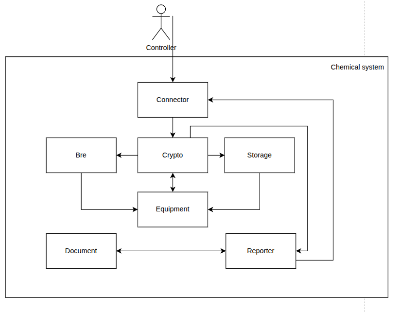

# Отчёт о выполнении задачи "Chemical-ICS"

- [Отчёт о выполнении задачи "Chemical-ICS"](#отчёт-о-выполнении-задачи-chemical-ics)
  - [Постановка задачи](#постановка-задачи)
  - [Общий алгоритм работы системы](#общий-алгоритм-работы-системы)
  - [Известные ограничения и вводные](#известные-ограничения-и-вводные)
    - [Цели и Предположения Безопасности (ЦПБ)](#цели-и-предположения-безопасности-цпб)
  - [Архитектура работы системы](#архитектура-работы-системы)
    - [Компоненты](#компоненты)
    - [Алгоритм работы решения](#алгоритм-работы-решения)
    - [Описание Сценариев (последовательности выполнения операций), при которых ЦБ нарушаются](#описание-сценариев-последовательности-выполнения-операций-при-которых-цб-нарушаются)
    - [Указание "доверенных компонент" на архитектурной диаграмме с обоснованием выбора.](#указание-доверенных-компонент-на-архитектурной-диаграмме-с-обоснованием-выбора)
    - [Известные проблемы реализации](#известные-проблемы-реализации)
    - [Политики безопасности](#политики-безопасности)
  - [Запуск приложения и тестов](#запуск-приложения-и-тестов)
    - [Запуск приложения](#запуск-приложения)
    - [Проверка позитивного сценария](#проверка-позитивного-сценария)
    - [Запуск тестов](#запуск-тестов)

## Постановка задачи
  Для автоматизации работы с опасными химическими веществами на произвостве и снижения числа человеческих ошибок, приводящих к авариям, необходимо разработать прототип киберимунной АСУ смешивания компонентов (далее - АСУ), которая сможет проверять доступность требуемого в операции оборудования, соответсвие введенных рецептур установленным нормам и тех.процессу и по итогу отдавать команды на работу с реактивами.

## Общий алгоритм работы системы
1. Контролер составляет рецептуру, указывая вещества для смешивания и требуемое оборудование (out of scope).
2. Контролер вводит в АСУ рецептуру.
3. АСУ проверяет допустимость смешивания веществ между собой и допустимость смешивания на выбранном оборудовании: проведение операции или отказ.
4. АСУ печатает отчет об операции: идентификационные данные, сведения о используемых веществах и оборудовании, список проверенных норм с примечанием о (не)соответсвии норме.

## Известные ограничения и вводные

По условиям организаторов должна использоваться микросервисная архитектура и шина обмена сообщениями для реализации асинхронной работы сервисов.

**Постановка задачи:**
  - В системиу поступает запрос на изготовление определенного вещества (его рецепт), после чего система проверяет наличие необходимого оборудования и компонентов, после выполнение опереций по изготовлению составляется отчет о приготовленном веществе с приложенными нормативно-правовыми актами на этом процесс заканчивается

Ценности, ущербы и неприемлемые события

|Ценность|Негативное событие|Оценка ущерба|Комментарий|
|:-:|:-:|:-:|:-:|
|Реагенты|Злоумышленник не должен знать с использованием каких реагентов производится изготовление веществ|Высокий|Производство может быть частью военной промышленности|
|Люди|Злоумышленник подменил вещества что привело к отравлению персонала|Высокий|На производстве могут использоваться токсичные вещества|
|Оборудование|Так как при производстве необходима точность и качество продукта, то повреждение или компроментация оборудования может привести к сбою в работе системы|Средний|В оборудование для работы с жидкостями было загружено твердое вещество что привело к поломке оборудования (оборудование застраховано)|
|Рецепты|Рецепт производства  вещества оказался доступен злоумышленникам|Высокий|Нарушение закона о защите секретной информации (так как система может быть частью военной промышленности)|

### Цели и Предположения Безопасности (ЦПБ)


**Цели безопасности:**
  1. Доступ к конфиденциальным данным имееют только авторизованные пользователи
  2. При любых обстоятельствах используются только целостностные критичные данные.
  3. При любых обстоятельствах выполняется только аутентичное и авторизованное задание.
  4. При любых обстоятельствах доступ к системе смещивания имееют только авторизованные пользователи

**Предположения безопасности:**
  1. Отсутствует физическое воздействие на компоненты.
  2. Все компоненты аутентичны и не имеют брака. 
  3. Вся информация в базах данных хранится в хешированном виде
  4. Controller авторизован и аутентичен
  5. Монитор безопасности и брокер сообщений доверенные модули


## Архитектура работы системы


1. Вся коммуникация между компонентами системы осуществляется через очереди сообщений.
2. Каждый компонент отвечает за свои собственные данные - расшаренных баз данных/общих файлов/информации нет.

### Компоненты
 - **BusinessRuleEngine (bre)** - сервис, отвечающий за хранение бизнес-правил и их выполнение относительно переданного запроса, содержащего перечни параметров оборудования и веществ.
 - **Document (document)** - сервис, отвечающий за хранение данных нормативных документов.
 - **Equipment (equipment)** - сервис, отвечающий за хранение списка оборудования и передачу команд и сигналов от контроллеров также осуществляет процесс смещивания компонентов (mixer).
 - **ReportGenerator (reporter)** - сервис, генерирующий отчет по запрошенной операции смешивания.
 - **Storage (storage)** - сервис, отвечающий за хранение остатков веществ на складе.
 - **Monitor** - авторизует операцию, если она удовлетворяет заданным правилам или блокирует её в противном случае.
 - **Connector** - выделенный с целью повышения возможностей безопасности модуль для связи с внешним миром на случай расширения функционала.

### Алгоритм работы решения


### Описание Сценариев (последовательности выполнения операций), при которых ЦБ нарушаются

Заказчиком были представлены наиболее волнующие его сценарии атаки, разберем их:
1. Подмена целиком или части ответа от любого из компонентов - приведет максимум к нарушению бизнес-функции, поскольку storage может не выделить компоненты, или reporter не отдать отчет.
2. Взлом базы или баз любого из компонента - учтено в список сценариев.
3. Перехват информации, циркулирующей между компонентами - доверяем message bus.
4. Перехват информации в шине данных - доверяем message bus.
5. Отправка информации в шину данных неавторизованным компонентом - monitor не пропустит сообщение адресату.
6. Искажение информации в базах данных компонентов - здесь я склонен считать, что искажение может быть на стороне заказчика при несогласованном изменении данных, если же мы говорим о сопутсвующем работе искажении данных, например, их замены, SQL-инъекцией и т.д., то это учтено в список сценариев.
7. Искажение работы BusinessRuleEngine - согласен, вписали его в доверенные, будем доверять и проверять.
8. Подмена передающихся между компонентами пакетов или их частей - практически невозможно вне доверенных компонентов в данной системе, кроме п.1.
9. Подмена команд АСУ оборудованию смешивания компонентов - участвуют только доверенные компоненты.
10. Блокировка команд АСУ к оборудованию компонентов - согласен, учтено в список сценариев.
11. Блокировка обмена сообщений между компонентами - доверяем монитору.
12. Искажение введенной рецептуры - здесь, при использовании криптографии, весьма затруднительно.


В результате произведенных над ней размышлений, наиболее вероятные сценарии нарушения ЦБ практически не изменились:
1. Заказ прислан злоумышленником + взлом connector; **авторизация + меры безопасности**
2. Прислан новый заказ; **блокировка**
3. Компонент взломан и меняет параметры запроса; **только в storage могут быть вопросы, надо принимать меры безопасности**
4. Какой-то компонент взломан и саботирует работу - простаивает; **тут все еще надо плакать**
5. Скрытые поля и их использование для code/sql injections; **валидация, экранирование**
6. Атака на "зависимости" - закладки в стороннем ПО, библиотеках; **локальные копии + проверка обновлений**
7. Неограниченное количество попыток на бронь оборудования/производных реагентов **в текущей реализации эта проблема минимальна**


**Отдельная диаграмма для первого негативного сценария - "чужого"" заказа:**


Нарушаются ЦБ 2,4

**Отдельная диаграмма для второго негативного сценария - повторного заказа:**


Нарушается ЦБ 3:


**Отдельная диаграмма для третьего негативного сценария - компрометация модуля storage**


Нарушаются ЦБ 1,2

**Отдельная диаграмма для четвертого негативного сценария - компрометация модуля equipment**


Нарушаются ЦБ 1,2,3,4

**Отдельная диаграмма для пятого негативного сценари - скрытых полей с управляющими командами для программных закладок/code-injection:**


Нарушаются ЦБ 1,2

**Отдельная диаграмма для шестого негативного сценария - атаки на зависимости:**


Нарушаются ЦБ 1,2,3

**Отдельная диаграмма для седьмого негативного сценария - неограниченного числа попыток бронирования оборудования:**


Нарушаются ЦБ 1,2

## Переработанная система

### Таблица новых компонентов


|Компонент|Описание|Комментарий|
|:---|:--|:--|
|Модуль шифрования|Расшифрование/шифрование принимаемых/отправляемых пакетов данных.|Работает при помощи протоколов криптографиия. Предполагается, что controller тоже реализован данный функционал|

### Переработанная архитектура



### Указание "доверенных компонент" на архитектурной диаграмме


### Оценка доверенности компонентов

|Компонент|Уровень доверия|Обоснование|Комментарий|
|:--|:--|:--|:--|
|1. Connector|$\textcolor{red}{\textsf{Недоверенный}}$|при компрометации не нарушаются ЦБ|Выделенный с целью повышения возможностей безопасности модуль для связи с внешним миром на случай расширения функционала|
|2. Crypto|$\textcolor{orange}{\textsf{Повышающий доверие}}$|при компрометации нарушаются ЦБ 1-6|Дает возможность шифровать сообщения а также подписывать их|
|3. Bre|$\textcolor{green}{\textsf{Доверенный}}$|при компрометации нарушаются ЦБ 1,2|сервис, отвечающий за хранение бизнес-правил и их выполнение относительно переданного запроса, содержащего перечни параметров оборудования и веществ|
|4. Storage|$\textcolor{green}{\textsf{Доверенный}}$|При компрометации нарушаются ЦБ 1,2|Cервис, отвечающий за хранение остатков веществ на складе|
|5. Equipment|$\textcolor{green}{\textsf{Доверенный}}$|При компрометации нарушаются ЦБ 1,2,3,4|Cервис, отвечающий за хранение списка оборудования и передачу команд и сигналов от контроллеров также осуществляет процесс смещивания компонентов (mixer)|
|6. Document|$\textcolor{red}{\textsf{Недоверенный}}$|При коммпрометации не нарушаются ЦБ|сервис, отвечающий за хранение данных нормативных документов|
|7. Reporter|$\textcolor{red}{\textsf{Недоверенный}}$|При коммпрометации не нарушаются ЦБ|сервис, генерирующий отчет по запрошенной операции смешивания|

### Замечания к реализации
- В некоторых модулях (например криптографии) будут реализованы лишь api функции
- Считаем что данные в БД находятся в хешированном виде (см. Предположения безопасности), а ответы которые мы получаем от БД преставляются перед нами в обычном текстовом виде 
- Через модуль криптографии будут общаться не только controller и connector, все обращения к модулям, содержащим БД будут проходить через жтот модуль, то есть в запросе будет хешироваться название компонета и другая критическая информация описанная в таблице оценки ущерба, таким образом модули содержащие БД могут быть недоверенными так как чувствительные данные будут проходить через них в виде хеша  
- Модуль mixer является составной частью equipment, не смотря на выделение его кеак отдельный контейнер
### Политики безопасности

```python {lineNo:true}

ordering = False

def check_operation(id, details):
   global ordering
   authorized = False

   print(f"[info] checking policies for event {id},"\
         f" {details['source']}->{details['deliver_to']}: {details['operation']}")
   src = details['source']
   dst = details['deliver_to']
   operation = details['operation']
   if not ordering:
       if  src == 'connector' and dst == 'equipment' \
           and operation == 'ordering' and len(details) == 9 :
           check = 4
           for x in details['mix']:
               if x.find(';')>=0:
                   print('SQL injection found!')
                   check-=1
           for x in details['amount']:
               if str(x).find(';')>=0:
                   print('SQL injection found!')
                   check-=1
           for x in details['from']:
               if x.find(';')>=0:
                   print('SQL injection found!')
                   check-=1
           for x in details['using']:
               if x.find(';')>=0:
                   print('SQL injection found!')
                   check-=1
           if check==4:
               authorized = True
               ordering = True


   if src == 'storage' and dst == 'equipment' \
       and operation == 'storage_status':
       authorized = True    

   if src == 'equipment' and dst == 'reporter' \
       and operation == 'operation_status':
       authorized = True
   if src == 'equipment' and dst == 'storage' \
       and operation == 'storage_book':
       authorized = True    
   if src == 'equipment' and dst == 'bre' \
       and operation == 'confirmation':
       authorized = True    
   if src == 'equipment' and dst == 'storage' \
       and operation == 'unblock':
       authorized = True    
   if src == 'equipment' and dst == 'storage' \
       and operation == 'decomission':
       authorized = True

   if  src == 'document' and dst == 'reporter'\
       and operation == 'acts_req':
       authorized = True


   if  src == 'reporter' and dst == 'document'\
       and operation == 'need_acts':
       authorized = True
   if  src == 'reporter' and dst == 'connector'\
       and operation == 'acts':
       authorized = True
       ordering = False

   if  src == 'bre' and dst == 'equipment'\
       and operation == 'confirmation':
       authorized = True

   return authorized

```

## Запуск приложения и тестов

### Запуск приложения

см. [инструкцию по запуску](README.md)

### Проверка позитивного сценария

После запуска команды make run и проверки того, что broker не упал, стоит воспользоваться командой _make logs_ и при помощи файла requsets.rest подать на вход выбранные параметры смешивания (например, уже готовый запрос). После этого начнется работа системы и будет отображаться лог работы, по итогу которой будет выведен результат, который выглядит примерно следующим образом:

connector_1 | Recipe - to mix: 
connector_1 | 1. A from storage in quantity 100 
connector_1 | 2. B from balloon#12 in quantity 10 
connector_1 | 3. cathalizator from storage in quantity 11 
connector_1 | Using: 
connector_1 | 1. list#22 
connector_1 | Rule#1 - True : Технология производства серной кислоты от 04.04.1985, п12 
connector_1 | Rule#3 - True : Приказ 1234 от 12.09.1967

Это будет говорить об успешном окончании работы системы и ее возможности принимать новые заказы.

### Запуск тестов

_Предполагается, что в ходе подготовки рабочего места все системные пакеты были установлены._

Запуск примера: открыть окно терминала в Visual Studio code, в папке chemical-ICS с исходным кодом выполнить

**make run**
или **docker-compose up -d**

Примечание: сервисам требуется некоторое время для начала обработки входящих сообщений от kafka, поэтому перед переходом к тестам следует сделать паузу 1-2 минуты

запуск тестов:
**make test**
